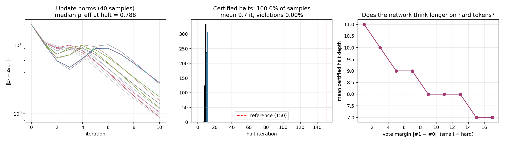

# Horizon Net

**A rendering trick from a WebGL game, ported into neural network inference — and then followed until it broke.**

The short version, because it changed:

> Horizon Net halts a weight-tied network the moment a Banach bound *proves* that thinking longer cannot change the answer. The certificate is sound. It has never produced a violation in any configuration we have run.
>
> **And on a good model it fires zero times.** Not because it is broken — because a contraction certificate can only fire once the state has stopped moving, and a state that has stopped moving has stopped computing. **Certified halting cannot compress useful computation. It can only recover compute that was already being wasted.**
>
> The speedups we first reported (65×, 15×) were real, sound, and were measuring the absurdity of our own baselines. We are leaving them up, with the correction attached.

Every mathematical ingredient here is old (Banach 1922, Lipschitz margins, deep equilibrium models). What this repo contains is a specific weld of them, four working implementations, measured results, and — in [`autopsy/`](autopsy/) — the experiment that killed the headline and the better thing that was underneath it.

*Do not hype. Do not lie. Just show.*

---

## Where this came from

This did not start as machine learning. It started as a rendering trick in a WebGL game,
[Antti's Brain 2](https://github.com/anttiluode/AnttisBrain2): a hall of convex mirrors
that shows apparently infinite recursive reflections while computing only **four**
bounces. Four is not a hack — it is the provably correct truncation depth, because each
bounce both dims the image (amplitude contraction) and shrinks it (spatial contraction),
and after four applications the remaining structure falls below one pixel. The infinite
series genuinely converges at 4 *in the only norm a retina can measure*.

Stated once as a principle: **when you want the appearance of unbounded recursive
structure, don't simulate the structure — implement one contracting operator and
truncate at the observation horizon.**

Horizon Net is that principle wearing a neural network. The "observer" is the readout
layer; the "resolution" is the decision margin; the "bounce count" is the iteration
depth.

**A substitution happened in that translation, and it took four experiments to find it.**
The raymarcher *truncates a transient* — it never computes the fixed point of the
rendering equation and never wanted to. Horizon Net *converges to a fixed point and
proves it can stop early.* Those are not the same sentence. Everything in `autopsy/`
follows from the difference.

## The math in five lines

For a contracting update map `f` with rate ρ < 1, iterated as `x_{n+1} = f(x_n)`, the
Banach a posteriori bound gives

```
‖x* − x_n‖ ≤ ρ/(1−ρ) · ‖x_n − x_{n−1}‖
```

where `x*` is the (never computed) infinite-depth fixed point. Push this through the
readout's Lipschitz constant `L` to bound how much the logits can still move, and halt
when

```
2 · L · ρ/(1−ρ) · ‖x_n − x_{n−1}‖  <  (top-1 logit − top-2 logit)
```

At that moment the infinite-depth network provably agrees with the current one. Halting
is a theorem firing per-sample, not a heuristic. That distinction is the whole point of
this repository, and it is held to that standard throughout — including where it hurts.

## The experiments

### 1. `horizon_net.py` — hard certificate (contraction guaranteed)

Weight-tied cell with spectral norm pinned to ρ = 0.8. Results (n = 2000, six ρ settings):

- Mean halt at **6.2 iterations** vs a 400-iteration reference, **100.0% prediction
  agreement** — the theorem checking out. The certificate is exact.
- **Resolution-horizon law confirmed:** demanding `b` bits of output precision costs
  depth *linear* in `b`. Measured 0.63 iterations/bit; empirical contraction
  (ρ_eff ≈ 0.38, far stronger than the 0.8 guarantee, thanks to tanh saturation)
  predicts 0.72.
- **Logged negative:** per-sample difficulty adaptivity is weak (~1 iteration between
  easy and hard). Depth ∝ log(1/margin), and strong contraction compresses the
  difficulty spectrum.

> ⚠️ **Correction (see `autopsy/`).** The "65× less compute" here is sound and it is a
> measurement of the 400-iteration reference, not of a speedup. Those 394 skipped
> iterations were doing nothing. **An impressive sound saving is a confession of a
> wasteful baseline.**

### 2. `horizon_transformer_probe.py` — soft certificate (contraction estimated online)

Weight-tied transformer block, **no** Lipschitz guarantee, ρ_eff fitted online. Task:
majority vote over binary sequences. Results (n = 1000):

- **Contraction emerged without being imposed:** median ρ_eff = 0.79.
- **Certificate fired for 100% of samples, mean halt 9.7 vs 150-iteration reference,
  0 violations** — honestly, violation rate < 0.3% at 95% confidence (rule of three).
- **Difficulty adaptivity appeared:** halt depth falls from 11 iterations on near-tied
  votes to 7 on landslides.

> ⚠️ **Correction (see `autopsy/`).** Two problems. (a) Same reference-absurdity as
> above. (b) The violation test only compared against the *final* reference, never
> against disagreement at *any* intermediate depth. It has **not** been re-audited under
> the ever-flip standard used in `autopsy/`, and it should be before it is cited.



### 3–6. [`autopsy/`](autopsy/) — the kill, and what was under it

The question the README used to list as next-step #2: *does the certificate fire on real
tokens?* A weight-tied causal transformer, char-level language model, tiny Shakespeare.

**It certified less than 1% of tokens.** Replicated on two machines independently.

The autopsy overturned the obvious diagnosis (the bound is *tight*, 2.2×; the estimator
is nearly exact; the oscillation everyone blames is a red herring), then overturned the
premise:

- **Competence is pinned to the training depth.** Accuracy peaks at exactly K — K=5 →
  peak 5; K=10 → peak 10 across three seeds — and then *decays monotonically* toward the
  fixed point. At K=5 the equilibrium reaches loss 3.84 against 4.17 for uniform noise.
  **The fixed point is not the model. It is where the model has finished forgetting.**
- **And the fixed point is perfectly path-independent** (AA = 1.000 from initializations
  out to σ=5). The boundary determines the bulk, exactly. The bulk it determines is
  unique, well-posed, and worse.
- **Retargeting the certificate at z_K instead of x\*** — one factor, `(1 − ρ^(K−n))`,
  a 13× tighter bound — is sound at every K, has zero violations, and **fires 94% of the
  time on the worst model and 0% on the best.**

Which is the mechanism, and it is not specific to Banach bounds:

> **A contraction certificate fires when the state has stopped moving. A state that has
> stopped moving has stopped computing. So the interval it skips is one the network was
> already idling through. The certificate does not compress computation — it discovers
> that computation had already ended.**

**Anytime inference, done soundly, is a null concept on a well-specified unrolled model.**
If you train at depth K, the model computes to depth K, and there is nothing to skip.

Full paper, ledger, and confounds: [`autopsy/README.md`](autopsy/README.md).

## What the certificate is actually for

It should change jobs. It is a sound instrument measuring the wrong thing.

> **The certified fraction of a weight-tied model is a sound, per-token measurement of
> its inference-time idleness.**

A model that certifies 94% of tokens at iteration 29 of 40 is telling you, with a proof
and zero violations, that a quarter of its inference does nothing — and that K should be
smaller. That is a real diagnostic, it has a theorem behind it, and it answers a question
practitioners actually have.

## The open problem

The **proof gap**. At K=10 the oracle halt — the iteration after which the prediction
never changes again — is **4.2**. The certificate cannot prove it at 9. And that gap is
*not* slack: the bound is 2.2× tight and ρ̂ = 0.976 against a true ρ = 0.959.

The gap is between **the state settling and the decision settling.** They are different
events. The decision goes first, by a factor of two. Roughly 58% of the compute is on the
floor, and **no sound state-space method can pick it up.**

Which lands back on the mirrors. The four-bounce truncation is provable because the
observer has a hard resolution limit — a **pixel**. There, *"below one pixel"* and
*"below the decision threshold"* are the same event, and the proof gap is zero. A network
has no pixel.

> **The resolution horizon is real. But it lives in the retina, not in the mirror.**

Horizon Net tried to derive the horizon from the operator's contraction rate. The game
got it from the eye. **A certificate that contracts in *decision space* rather than state
space** is the next thing, and it is not written.

## Honest ledger

- Toy scales throughout. D=64, char-level, one CPU core. The *mechanism* argued above is
  architecture-independent by argument; the *numbers* are not.
- **The load-bearing claim is a conjecture, not a theorem.** "A state that has stopped
  moving has stopped computing" is formally unproven, and our own directional experiment
  showed decisions flipping while the state barely moved — which is precisely the shape
  of the counterexample. Someone should prove it or break it.
- **The K=20/K=40 arms are confounded** (they also trained worse). The control that
  settles it is specified in `autopsy/` and has not been run.
- Every negative result in this repo is logged next to the positive one it kills.
  Bugs confessed: the first certificate could never fire (a stray epsilon made each class
  fail comparison against itself); the first theory line used the guaranteed ρ where the
  empirical rate belonged; a proposed directional certificate certified 98.5% of tokens
  and was **wrong one time in three** — killed by its own pre-registered check.
- **Prior-art status unresolved.** Adjacent: DEQ residual tolerances (heuristic stopping,
  no margin coupling); ACT and PonderNet (learned halting, no bound); Anil et al. 2022
  on path independence. We have not found the §6 claim stated. **"Not found" is not
  "doesn't exist."** A serious literature pass is step one before any strong claim.

## Files

```
horizon_net.py                        exp 1: hard certificate, MLP cell
horizon_transformer_probe.py          exp 2: soft certificate, attention block
autopsy/                              exp 3-6: the language-model kill and the paper
  README.md                           the paper: "The Certificate Can Only Find the Waste"
  horizon_lm_probe.py                 <1% certified on real tokens
  horizon_lm_autopsy.py               the bound is tight; the estimator is innocent
  horizon_directional.py              a fix, falsified by its own check
  horizon_fixedpoint_tax.py           accuracy decays toward the fixed point
  horizon_aa_score.py                 path independence holds: AA = 1.000
  horizon_optimum.py                  the K-sweep: peak = K, and the retargeted halt
```

## Reproducing

```bash
pip install numpy matplotlib          # experiment 1
python horizon_net.py

pip install torch                     # experiments 2-6 (CPU is fine)
python horizon_transformer_probe.py
cd autopsy && python horizon_optimum.py     # ~45 min on one core
```

Everything is seeded. If your numbers differ materially from the ones here, **that is a
result** — please open an issue.

---

*Part of the PerceptionLab research program. We wanted a faster network. We got a proof
that the speedup we were chasing was a measure of our own waste. We are publishing the
second one.*
